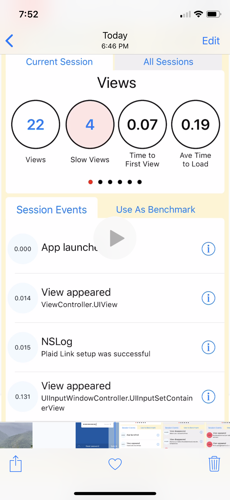
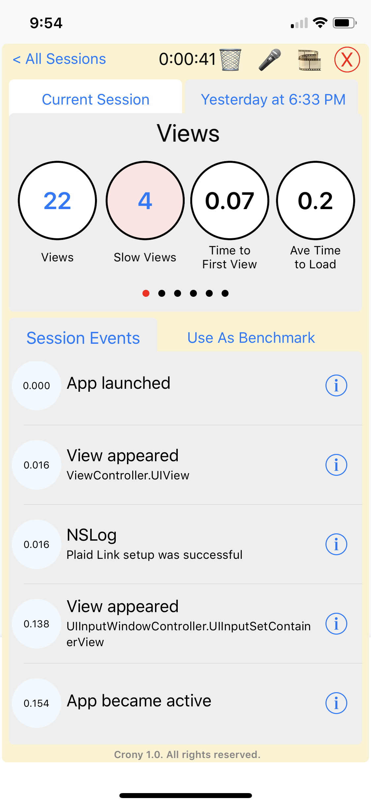
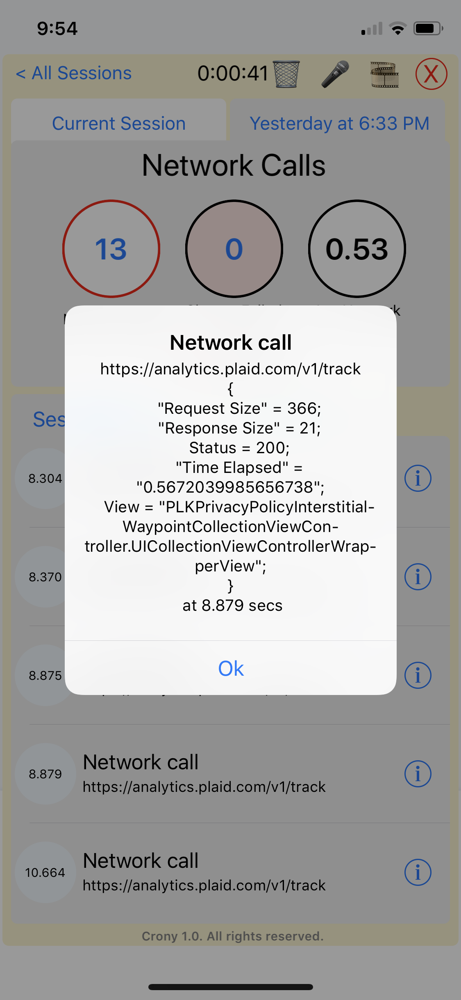
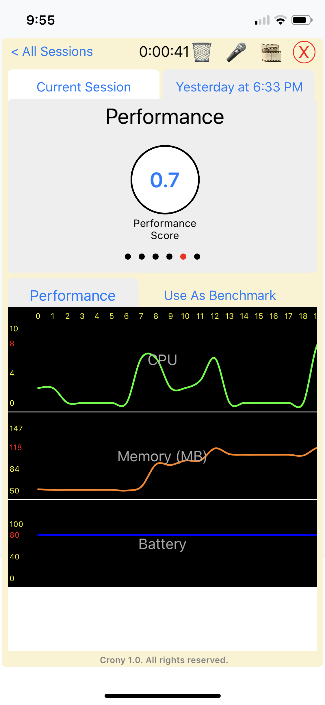
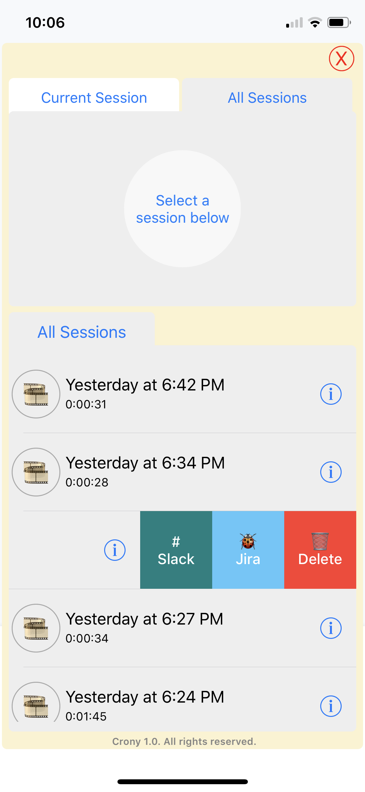

# Crony
#### Record. Share. Fix.

# What is Crony?
Crony is a pal for mobile app testers and developers. Crony brings them closer together to capture and share information in real-time.

# Record
1. On-demand or always
1. Screenshots and videos
1. Voice memos
1. Network Calls, Views, Spinners, and user gestures
1. Log messages
1. Performance (CPU, MEM, Disk, and Battery)
1. On-device view of the recordings

# Share
1. Share full or partial recordings right from the device using the apps like messenger, slack etc.
1. Send them to content management systems (sharepoint), bugtracking systems (Jira etc.) from the device

# Fix
1. Developers and app owners get all the information they need without any communication failures to fix the issues

### Usage
## XCode Intregration
1. Drag Crony folder and drop it into your XCode project
2. Select "Copy items if needed" and "Create groups" options
3. Select the targets and click Finish
4. Go to Build Settings and add -ObjC as additional linker flag
5. Open your AppDelehgate.m file include BSCrony.h
6. in didFinishLaunchingWithOptions, add the following line;
```
   [BSCrony initializeCrony:nil];
```
7. Compile and run the app

When your app is running, just swipe from left edge of your device or simulator to bring Crony view.

# Demo Video and Images
<a href="http://www.youtube.com/watch?feature=player_embedded&v=_P_9GB8d0AA" target="_blank"></a>

         


        


# Contact 
[Suman Cherukuri](mailto:suman@crony.us?subject=[GitHub]%20Crony)


